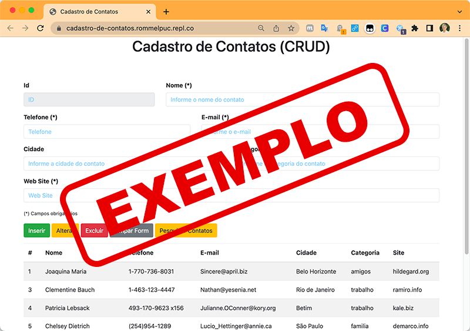

# Introdução

Informações básicas do projeto.

* **Projeto:** Aumento de Moradores de Rua
* **Repositório GitHub:** [[LINK PARA O REPOSITÓRIO NO GITHUB]](https://github.com/ICEI-PUC-Minas-PPLCC-TI/ti-1-ppl-cc-m-2024-2-g1-aumento-de-moradores-de-rua/tree/master)
  
* **Membros da equipe:** 
* [Any Gabrriela Neri de Oliveira](https://github.com/anygabriella)
* [Eduardo Henrique Aniceto Teixeira](https://github.com/Eduard-Aniceto)
* [Frederico Matheus Costa Duarte](https://github.com/Freduart12)
* [Izabel Oliveira da Paz Chaves](https://github.com/rainbowcrack)
* [Vitor Daniel Silva Melo](https://github.com/vloax)


A documentação do projeto é estruturada da seguinte forma:

1. Introdução
2. Contexto
3. Product Discovery
4. Product Design
5. Metodologia
6. Solução
7. Referências Bibliográficas

✅ [Documentação de Design Thinking (MIRO)](files/Aumento-de-moradores-de-rua.pdf) <-- **[MODIFICAR, ESTÁ EM BAIXA QUALIDADE]()

# Contexto
A população em situação de rua totalizou 5.344 em BH no ano de 2022, segundo o "Censo Pop Rua" da Faculdade de Medicina da UFMG representando um aumento de 192%. A partir desse contexto, torna-se essencial resolver esse problema, por isso nosso projeto busca compreender as necessidades do nosso público-alvo vulnerável, as pessoas em situação de rua, e, por meio disso, estudá-las através de estatísticas e mapeamento, além da integração com serviços sociais. Embora, a aplicação se destine principalmente a Órgãos que são e não governamentais.

## Objetivos
**Objetivo Geral:**
Desenvolver um aplicativo para ONGs que facilite a identificação e mapeamento de moradores de rua, promova a arrecadação de doações e forneça informações sobre as ONGs participantes, com o intuito de melhorar a gestão de recursos e a assistência a essas populações.

**Objetivos Específicos:**
Mapear a população em situação de rua: Criar uma funcionalidade que permita registrar e visualizar a localização dos moradores de rua, ajudando ONGs a direcionar melhor seus esforços e recursos.
Facilitar a captação de doações: Implementar um sistema no app que permita que doadores localizem pontos de coleta, façam doações online ou se conectem diretamente com ONGs.
Fornecer informações detalhadas sobre as ONGs: Desenvolver uma área dedicada no aplicativo onde os usuários possam conhecer o trabalho das ONGs, suas missões, áreas de atuação e como podem colaborar.
Promover a interação entre ONGs e a comunidade: Facilitar a comunicação entre ONGs e voluntários, doadores e outros stakeholders, promovendo ações conjuntas e campanhas.
Aumentar a conscientização sobre a situação dos moradores de rua: Utilizar o aplicativo como uma plataforma de sensibilização, mostrando a realidade das pessoas em situação de rua e incentivando a participação da sociedade na solução desse problema.
Oferecer uma interface intuitiva e acessível: Garantir que o aplicativo seja fácil de usar, mesmo para usuários com pouca familiaridade com tecnologia, e acessível a pessoas com diferentes necessidades.

## Justificativa

O aumento do número de moradores de rua é uma questão social urgente e complexa que afeta milhões de pessoas em todo o mundo. Isso resulta de uma combinação de factores, incluindo a falta de habitação acessível, desemprego, problemas de saúde mental e escassez de serviços de apoio. Diante desse cenário, a atuação das Organizações Não Governamentais (ONGs) torna-se fundamental para prestar assistência e promover a reintegração social dessas pessoas.

Este trabalho justifica-se pela necessidade de criar uma ferramenta digital que facilite a atuação das ONGs e melhore a eficiência de suas operações. O desenvolvimento de um aplicativo específico para esse público-alvo visa atender a diversas necessidades, como a gestão de ações, o acompanhamento de moradores de rua, a integração com redes sociais, e o registro de ações de voluntariado.

## Público-Alvo

O público-alvo do aplicativo específico para ONGs que atuam no apoio a moradores de rua é composto por três grupos principais:

**1-Organizações Não Governamentais (ONGs):**

As ONGs são o foco principal do aplicativo, pois são as responsáveis ​​por fornecer assistência e apoio direto aos moradores de rua. O aplicativo deve atender suas necessidades operacionais, facilitando a gestão de ações, o acompanhamento de ações de voluntariado e a integração com parceiros.

**2-Moradores de Rua:**

Os moradores de rua são os beneficiários das ações realizadas pelas ONGs. O aplicativo deve ser projetado para atender suas necessidades, permitindo que as ONGs registrem informações sobre sua localização, saúde e bem-estar, além de possibilitar um acompanhamento mais eficaz. 

**3-Voluntários e Doadores:**

O aplicativo também é destinado a voluntários e doadores que desejam contribuir com as ONGs. A plataforma deve facilitar o engajamento desses indivíduos, permitindo que eles se inscrevam para ações de voluntariado, façam ações financeiras e acompanhem o impacto de suas contribuições.**


# Product Discovery

## Etapa de Entendimento

 ### Matriz CSD: 
 Na matriz foram identificadas as seguintes dúvidas, certezas e suposições: 

 **1- Dúvidas**: 
 ▸ Uma vez que há o investimento inicial de R$982 milhões pelo governo para pessoas em situação de rua, como tal verba é distribuída? 
 ▸ Por que não vemos o impacto deste "benefício" na vida diária dos afetados?
 ▸ Quais os principais fatores socioeconõmicos que contribuem para o aumento de moradores de rua?
 ▸ Qual a relação entre educação e prevenção da população de rua?

 **2- Certezas**: 
 ▸ Falta de Pesquisa e Mensuração: Há uma disparidade entre os números dos moradores de rua calculados pela Prefeitura de BH, com a realidade.
 ▸ Poucas Verbas e Sub-notificação: A precariedade de pesquisas na área, não compreende a dimensionalidade dos moradores de rua e suas necessidades, que resulta em pouca verba estatal.
 ▸ Aumento dos Moradores de Rua: a cada ano, há um aumento progressivo dos Moradores de Rua, por "n" motivos (desemprego, inflação, falta de políticas pública, má gestão...).
 ▸ Condições de Insalubridade e Doenças Autoimunes: Há relação entre o aumento do número de doenças auto-imunes nos cidadãos, sob o viés da contaminação.

 **3- Suposições**: 
 ▸ Através de um investimento público  localizado e correto, Haverá uma diminuição significativa dos moradores de rua.
 ▸ Melhorias no acesso a empregos e educação, ajudariam no processo.
 ▸ O preconceito da população auxilia na estabilização e perpetuação do problema.
 ▸ Existe um grande desinteresse por parte política em achar formas que visem resolver as causas estruturais de falta de moradia.


 ### Mapa de stakeholders: 
Na fase de Mapa de stakeholders apresentamos as seguintes pessoas:

 **1- Pessoas Fundamentais**: ▸ Doadores
 ▸ Moradores de rua
 Prefeitura de BH

 **2- Pessoas Importantes**: ▸ Abrigos e ONG's
 ▸ Trabalhores Sociais e Profissionais da Saúde

 **3- Pessoas Influenciadoras**: ▸ População
 ▸ Mídia


### Entrevistas qualitativas: 
Nesta etapa fizemos as seguintes perguntas para os desabrigados e coletamos as informações:

 **1- Como são os abrigos para moradores de rua?**: No geral, existem reclamações sobre a falta de segurança,
existência de ladrões (o que gera insegurança), super lotação nos quartos, entre outros.

**2- O que os levou à chegar até tal situação?**: Comumente são problemas associados a perda de
familiares próximos, como mãe e pai, e por não receberem o apoio necessário (tanto financeiro quanto emocional)  para seguirem seu cotidiano, se veem sem outra escolha. Além de problemas com vícios e drogas.

**3- Como são as doações recebidas?**: No que se refere a doações / ajudas recebidas por eles pela população local, ambos apresentaram opiniões positivas, alegando uma empatia considerável dos urbanistas a sua situação. Entretanto houve uma divergência de opiniões sobre o amparo oferecido pelo governo, onde um relata receber auxílio, enquanto o outro nunca teve acesso a algo do tipo.


A seguir são perguntas foram feitas para um profissional que trabalha com lipeza pública e tem contato direto com tal população: 

**1- Como os moradores de rua influenciam seu trabalho?**: "Trabalhando na área pública, frequentemente nos deparamos com pessoas em situação de rua que, infelizmente, não demonstram interesse em mudar de vida. Isso pode prejudicar o nosso trabalho, pois muitos acabam utilizando as ruas para suas necessidades básicas e descartando lixo de forma inadequada. Eu acredito que viver nessas condições não é positivo, tanto para eles quanto para a comunidade em geral, e isso reflete negativamente no nosso dia a dia."

**2- Quais são os aspectos positivos dessa convivência?**: "O lado positivo é que, na maioria das vezes, são pessoas educadas e amigáveis. Contudo, sempre existem exceções, e há alguns indivíduos mais agressivos que dificultam o nosso trabalho."

**3- Como você percebe o tratamento da população em relação aos moradores de rua?**: "É uma situação muito paralela. Percebo que muitas pessoas se preocupam em ajudar, mas, em muitos casos, os próprios moradores de rua não buscam sair dessa situação. Isso torna o processo de ajuda muito complicado. Conheço, por exemplo, uma pessoa que teve a oportunidade de mudar de vida, com emprego e tudo, mas preferiu continuar no vício das drogas e da bebida. Isso torna realmente difícil prestar qualquer tipo de assistência."


 ### Highlights de pesquisa: 

 **Nome**: Entrevista com duas pessoas em situação de rua e um trabalhador da prefeitura.

 **Data**: 30/08/2024.

 **Local**: Praça da Liberdade, Lourdes.

 **O que os participantes falaram ou fizeram que surprendeu, ou falas mais significativas**: ▸ Um dos moradores entrevistados estava lendo livros e disse que parou os estudos no ensino médio.
 ▸ Ambos disseram sobre a falta de segurança nos abrigos, justificado pela preferência nas ruas.
 ▸ O trabalhador destacou mais aspectos negativos sobre as pessoas em situação de rua.
 ▸ Informou sobre a dificuldade de manter e limpar as ruas com a presença deles.


 **Principais temas ou aprendizados que surgiram desta entrevista**: É possível observar a dicotomia entre os entrevistados, do qual os moradores de rua preferem permanecer no estado em que se encontram, optando pela ajuda alheia, e o trabalhador da prefeitura preferem que saiam das ruas, como também que ninguém forneça doações.
Com os aprendizados que vivenciamos, o grupo chegou a conclusão que devemos nos ater nas necessidades do nosso público alvo, os próprios moradores que vivenciam tal realidade, por isso nossa solução deve priorizar sua capacidade de escolha. Não devemos, desenfreadamente, submeter nossos próprios pensamentos em querer levá-los aos abrigos, sem a menos entender a crítica situação das políticas públicas e da segurança.


**Aspectos que importaram mais para os participantes**: Entre as pessoas em situação de rua, destaca-se a preferência pessoal em permanecer nas ruas em contraponto aos abrigos. Ademais, sobre a falta de suporte familiar incutidos em seus passados, que preferem ao menos comentar. A ajuda dos pedestres com a doação de roupas e de alimentos se faz presente recorrente, contribuindo para a confiança em um ambiente de gratidão pela boa ação.
O trabalhador da prefeitura, responsável pela limpeza e manutenção das ruas, adotou uma postura radical em relação ao público em situação de rua afirmando que dificultam o seu trabalho ao remexerem nos lixos, além de que alguns podem ser agressivos. Justificou sua postura frente essa problemática defendendo a realocação deles de forma mais rápida possível.


**Novos tópicos ou questões para explorar no futuro**: Pensamos em entender melhor a realidade das pessoas em situação de rua, de um viés mais qualitativo e governamental. Consoante a isso exploraremos no futuro próximo:
▸ Como funciona o sistema de segurança e a infraestrutura nos abrigos?
▸ O que fazer para atrair o nosso público aos abrigos?
▸ Como unir ONG's e voluntários a esse projeto?
Exploramos as ODS's da ONU e queremos que a tecnologia dialogue com a fraternidade humana. Buscaremos outros projetos e soluções para inspirar a nossa ideia e aprender o que deu errado.
Queremos dialogar com os nossos colegas de classe de T.I 1 que possuem temas que abrangem o que buscamos, para achar a melhor solução: "Desperdício de Comida", "Desemprego", "Dificuldade de Doações a ONG's" e o grupo de "Vícios".


## Etapa de Definição

### PERSONA 1

[Joao](images/Persona-Joao.png)

**Nome:** João da Silva.
**Idade:** 40 anos. 
**Hobby:** Ler livros achados na rua.
**Trabalho:** Desempregado.
**Personalidade:** Agressivo com quem o trata mal ou é preconceituoso. Ele é atensioso com quem o ajuda e retribui com a sua gratidão desejando o bem para aquela pessoa.
**Sonhos:** Constituir renda própria, ter uma moradia fixa que preze sua privacidade embora prefira as ruas, ter suas necessidades básicas atendidas.

**Objetos e lugares:** João não possui objetos digitais, só tem um radinho velho e tem contato com as notícias do mundo a partir das conversas com o jornaleiro. Ele possui um cachorro caramelo da raça vira-lata e seus livros, leva seus pertences em um carrinho de compra e onde escolheu para ficar estendeu sua barraca de dormir.
**Objetivos chave:** A pessoa necessita de assistência médica, atendimento de necessidades básicas, adquirir doações, segurança de vida, proteção contra o frio, atendimento psicológico...
**Como devemos tratá-la:** Devemos tratar João com respeito e de forma informal.


### PERSONA 2

[Ana](images/Persona-Ana.png)

**Nome:** Ana Paula Ribeiro.
**Idade:** 38 anos.
**Hobby:** Viajar, cozinhar e conhecer novas culturas.
**Trabalho:** Fundadora e executiva de uma ONG.
**Personalidade:** Ana é determinada e muito empática. Conhecida por sua habilidade em se conectar com as pessoas e se envolver em causas importantes. Ela valoriza trabalho em equipe e sempre busca soluções criativas.
**Sonhos:** O principal sonho de Ana é conseguir expandir sua empresa, alcançar outras partes do estado e do Brasil, conquistar mais reconhecimento e ajudar cada vez mais moradores de rua.

**Objetos e lugares:** Devido ao fato de Ana possuir uma ONG bem estruturada, ela já conta com objetos físicos contemporâneos, como celulares e computadores, além dos essenciais ao seu trabalho (cadernos, pranchetas e outros). Ademais vale ressaltar o uso de redes sociais, usado para conseguir mais visibilidade. No geral, ela os usa diariamente no seu ambiente de ocupação como ferramentas fundamentais para manter o desenvolvimento do seu negócio.
**Objetivos chave:** O indivíduo carece de destaque e relevo social, ajudas financeiras
(feitas por doações ou auxílios do governo), recursos limitados (como falta de contribuições de roupas, alimentos, medicamentos e outros), escassez de voluntários, estigmatização e preconceito, entre outros. Seu objetivo é conseguir resolver tais problemáticas para que assim atenda com mais qualidade os necessitados. Devemos tratar com dignidade e respeito, reconhecer e valorizar o trabalho, oferecer suportes, para que assim possam operar de maneira eficaz. Eles ficam felizes quando recebem apoio e prestígio.
**Como devemos tratá-la:** Devemos tratar Ana com respeito e de forma formal. 


# Product Design

Nesse momento, vamos transformar os insights e validações obtidos em soluções tangíveis e utilizáveis. Essa fase envolve a definição de uma proposta de valor, detalhando a prioridade de cada ideia e a consequente criação de wireframes, mockups e protótipos de alta fidelidade, que detalham a interface e a experiência do usuário.

## Histórias de Usuários

[História de usuários](images/Historia-de-usuarios.jpg)


| **EU COMO...**          | **QUERO/PRECISO ...**                       | **PARA ...**                             |
| ----------------------- | ------------------------------------------- | ---------------------------------------- |
| Morador de rua          | Oportunidades de acesso a documentações/    | Conseguir um emprego e resolver          |
|                         | serviços jurídicos                          | questões legais                          |
| ----------------------- | ------------------------------------------- | ---------------------------------------- |
| Morador de rua          | Doações básicas, como roupas e comidas      | Me proteger do frio e não passar fome    |
| ----------------------- | ------------------------------------------- | ---------------------------------------- |
| Morador de rua          | Assistência médica e psicológica            | Não adoecer                              |
| ----------------------- | ------------------------------------------- | ---------------------------------------- |
| Morador de rua          | Abrigos com segurança                       | Conseguir dormir em locais seguros e     |
|                         |                                             | assim manter uma saúde física e menta    |
| ----------------------- | ------------------------------------------- | ---------------------------------------- |
| Fundadora e diretora    | Doações, auxílio do governo e voluntários   | Manter o funcionamento da ONG            |
| e diretora de uma ONG   |                                             |                                          |
| ----------------------- | ------------------------------------------- | ---------------------------------------- |
| Fundadora e diretora    | Mais visibilidade                           | Que novas pessoas conheçam e se sintam   |
| e diretora de uma ONG   |                                             | tocadas com o nosso trabalho             |
| ----------------------- | ------------------------------------------- | ---------------------------------------- |
| Fundadora e diretora    | Mais voluntários                            | Que o processo de distruibuição de       |
| e diretora de uma ONG   |                                             | doações seja mais eficaz                 |
| ----------------------- | ------------------------------------------- | ---------------------------------------- |
| Doador em potencial     | Ferramentas hábeis e competentes            | Entender e acompanhar como minhas        |
|                         |                                             | doações estão sendo aplicadas            |
| ----------------------- | ------------------------------------------- | ---------------------------------------- |
| Doador em potencial     | Ferramentas hábeis e competentes            | Observar os impactos e resultados das    |
|                         |                                             | possíveis doações                        |
| ----------------------- | ------------------------------------------- | ---------------------------------------- |


## Proposta de Valor

##### Proposta para Persona Ana

[Proposta de valor Ana](images/Proposta-de-valor-Ana.png)


#### Proposta para Persona João

[Proposta de valor João](images/Proposta-de-valor-Joao.png)


## Requisitos

As tabelas que se seguem apresentam os requisitos funcionais e não funcionais que detalham o escopo do projeto.

# Documento de Requisitos

## RF01 - Efetuar Cadastro

### Requisito Funcional

- **Nome:** Efetuar cadastro
- **Código:** RF01
- **Descrição:** O sistema deve registrar as informações do cadastro realizado no sistema.
- **Prioridade:** Essencial.

### Requisitos Não Funcionais

| ID RNF | Descrição                                                                                                                                                                                                                      | Categoria   |
| ------ | ------------------------------------------------------------------------------------------------------------------------------------------------------------------------------------------------------------------------------ | ----------- |
| 1.1    | Poderá ser feito o cadastro como ONG, Voluntário ou Doador por intermédio de uma caixa seletora.                                                                                                                               | Interface   |
| 1.2    | Para realizar o cadastro da ONG, é necessário inserir os campos: nome, foto, objetivo, CEP, país, estado, cidade, bairro, rua, número, nome, CPF e data de nascimento da pessoa responsável, telefone, email, CNPJ, chave PIX. | Interface   |
| 1.3    | O cadastro de Voluntários é necessário informar: nome, foto, país, estado, cidade, bairro, rua, número, CPF, data de nascimento, telefone, email.                                                                              | Interface   |
| 1.4    | O cadastro de Doadores é necessário inserir: nome, foto, país, estado, cidade, bairro, rua, número, informar se é pessoa física ou jurídica, telefone e email.                                                                 | Interface   |
| 1.5    | Todas as categorias de usuário devem criar uma senha.                                                                                                                                                                          | Interface   |
| 1.6    | Todos os campos são obrigatórios.                                                                                                                                                                                              | Usabilidade |
| 1.7    | Essa função estará disponível no Cabeçalho quando não estiver logado no sistema.                                                                                                                                               | Usabilidade |
| 1.8    | Quando o CEP for inserido, serão preenchidos automaticamente os campos país, estado, cidade, bairro e rua.                                                                                                                     | Usabilidade |
| 1.9    | Validação do cadastro da ONG.                                                                                                                                                                                                  | Usabilidade |
| 2.0    | Quando o CPF e CNPJ forem preenchidos, haverá a verificação para saber se são válidos.                                                                                                                                         | Usabilidade |

---
|ID RNF | Prioridade |
| ----- | ---------- |
| 1.1   | Alta       |
| 1.2   | Alta       |
| 1.3   | Alta       |
| 1.4   | Alta       |
| 1.5   | Alta       |
| 1.6   | Alta       |
| 1.7   | Média      |
| 1.8   | Baixa      |
| 1.9   | Alta       |
| 2.0   | Alta       |
---

## RF02 - Realizar Login

### Requisito Funcional

- **Nome:** Realizar login
- **Código:** RF02
- **Descrição:** O sistema deve efetuar o login.
- **Prioridade:** Essencial.

### Requisitos Não Funcionais

| ID RNF | Descrição                                                                                                 | Categoria   |
| ------ | --------------------------------------------------------------------------------------------------------- | ----------- |
| 2.1    | Antes de preencher os campos do login, é necessário informar o tipo de acesso: ONG, Voluntário ou Doador. | Interface   |
| 2.2    | Para a efetuação do login, o usuário deve inserir o email de registro e informar a senha criada.          | Interface   |
| 2.3    | A autenticação do usuário dará por validação de e-mail e teste de Captcha.                                | Usabilidade |
| 2.4    | Haverá a opção de preferência por manter o login salvo.                                                   | Interface   |
| 2.5    | Haverá verificação para saber se os campos preenchidos do ID da ONG e da senha estão corretos.            | Usabilidade |

---
|ID RNF | Prioridade |
| ----- | ---------- |
| 2.1   | Alta       |
| 2.2   | Alta       |
| 2.3   | Alta       |
| 2.4   | Média      |
| 2.5   | Alta       |
---

## RF03 - Atualização de Perfil

### Requisito Funcional

- **Nome:** Atualizar perfil 
- **Código:** RF03
- **Descrição:** O sistema deve atualizar as informações. 
- **Prioridade:** Importante.

### Requisitos Não Funcionais

| ID RNF | Descrição                                                                      | Categoria   | 
| ------ | ------------------------------------------------------------------------------ | ----------- | 
| 3.1    | Para realizar a atualização das informações.                                   | Interface   |
| 3.2    | As informações passarão por uma fase de validação antes da publicação.         | Segurança   |
| 3.3    | A opção de atualizar perfil estará disponível no menu do usuário após o login. | Usabilidade |

---
|ID RNF | Prioridade |
| ----- | ---------- |
| 3.1   | Alta       |
| 3.2   | Alta       |
| 3.3   | Média      |
---

## RF04 - Recuperação de Senha

### Requisito Funcional

- **Nome:** Recuperar senha
- **Código:** RF04
- **Descrição:** O sistema deve permitir que os usuários recuperem a senha.
- **Prioridade:** Importante.

### Requisitos Não Funcionais

| ID RNF | Descrição                                                                                            | Categoria   | 
| ------ | ---------------------------------------------------------------------------------------------------- | ----------- |
| 4.1    | Para recuperar a senha o usuário deverá inserir o EMAIL e CNPJ/CPF que foram informados no cadastro. | Interface   |
| 4.2    | Será enviado um email com um link que redirecionará para a página de recuperação de senha.           | Usabilidade |
| 4.3    | Na página de redefinição de senha, o usuário deverá inserir e confirmar a nova senha.                | Interface   |
| 4.4    | A nova senha deverá atender aos critérios de segurança estabelecidos (mínimo de caracteres, etc.).   | Segurança   |

---
|ID RNF | Prioridade |
| ----- | ---------- |
| 4.1   | Alta       |
| 4.2   | Alta       |
| 4.3   | Alta       |
| 4.4   | Alta       |
---

## RF05 - Realizar Logoff

### Requisito Funcional

- **Nome:** Realizar Logoff
- **Código:** RF05
- **Descrição:** Permite que o usuário saia do sistema.
- **Prioridade:** Essencial.

### Requisitos Não Funcionais

| ID RNF | Descrição                                                                                                                          | Categoria   |
| ------ | ---------------------------------------------------------------------------------------------------------------------------------- | ----------- |
| 5.1    | Para realizar o logoff é necessário que o usuário clique em SAIR após estar logado.                                                | Interface   |
| 5.2    | Se o usuário não estiver logado, a opção SAIR será inexistente.                                                                    | Interface   |
| 5.3    | Após clicar em SAIR, todo o sistema é atualizado e direcionado para a página inicial.                                              | Usabilidade |
| 5.4    | Toda e qualquer interação com SAIR, limpa os campos necessários para efetuar o login a não ser que as preferências estejam salvas. | Segurança   |

---
|ID RNF | Prioridade |
| ----- | ---------- |
| 5.1   | Média      |
| 5.2   | Média      |
| 5.3   | Alta       |
| 5.4   | Alta       |
---

## RF06 - Realizar Doação

### Requisito Funcional

- **Nome:** Realizar Doação
- **Código:** RF06
- **Descrição:** O sistema deve direcionar para a página de doações e realizar as transações.
- **Prioridade:** Essencial.

### Requisitos Não Funcionais

| ID RNF | Descrição                                                                                               | Categoria   |
| ------ | ------------------------------------------------------------------------------------------------------- | ----------- |
| 6.1    | A opção REALIZAR DOAÇÃO aparecerá somente para a categoria de usuários cadastrados como doadores.       | Interface   |
| 6.2    | Ao clicar em REALIZAR DOAÇÃO, o doador é direcionado para a página de doações.                          | Usabilidade |
| 6.3    | O sistema deve oferecer as opções de pagamento: PIX, cartão de crédito/débito ou boleto bancário.       | Usabilidade |
| 6.4    | Ao selecionar PIX, será exibida a chave PIX da ONG ou um QR Code para pagamento.                        | Interface   |
| 6.5    | Para cartão, o doador deverá inserir número do cartão, validade, código de segurança e nome do titular. | Interface   |
| 6.6    | Após a confirmação do pagamento, o sistema emitirá um comprovante de doação para o doador.              | Segurança   |
| 6.7    | Todas as transações devem ser realizadas em ambiente seguro com criptografia de dados.                  | Segurança   |

---
|ID RNF | Prioridade |
| ----- | ---------- |
| 6.1   | Alta       |
| 6.2   | Alta       |
| 6.3   | Alta       |
| 6.4   | Média      |
| 6.5   | Alta       |
| 6.6   | Média      |
| 6.7   | Alta       |
---

## RF07 - Visualizar Histórico de Doações Recebidas

### Requisito Funcional

- **Nome:** Visualizar Histórico de Doações Recebidas
- **Código:** RF07
- **Descrição:** O sistema deve permitir que a ONG visualize o histórico de doações recebidas.
- **Prioridade:** Essencial.

### Requisitos Não Funcionais

| ID RNF | Descrição                                                                                                              | Categoria   |
| ------ | ---------------------------------------------------------------------------------------------------------------------- | ----------- |
| 7.1    | A ONG poderá visualizar uma lista com todas as doações recebidas, incluindo data, valor e doador (se não for anônimo). | Interface   |
| 7.2    | O sistema deve permitir filtrar o histórico por período, valor ou doador.                                              | Usabilidade |
| 7.3    | Os dados devem ser apresentados de forma clara e organizada, com opção de exportar relatórios.                         | Usabilidade |

---
|ID RNF | Prioridade |
| ----- | ---------- |
| 7.1   | Alta       |
| 7.2   | Alta       |
| 7.3   | Alta       |
---

## RF08 - Registrar Ações de Voluntariado

### Requisito Funcional

- **Nome:** Registrar Ações de Voluntariado
- **Código:** RF08
- **Descrição:** A ONG pode registrar ações de voluntariado para gerenciamento interno e convite a voluntários.
- **Prioridade:** Essencial.

### Requisitos Não Funcionais

| ID RNF | Descrição                                                                                                         | Categoria   |
| ------ | ----------------------------------------------------------------------------------------------------------------- | ----------- |
| 8.1    | A ONG poderá criar eventos ou ações detalhando data, hora, local, atividades e número de voluntários necessários. | Interface   |
| 8.2    | O sistema deve permitir que voluntários se inscrevam nas ações disponíveis.                                       | Usabilidade |
| 8.3    | A ONG poderá gerenciar a lista de voluntários inscritos em cada ação.                                             | Usabilidade |

---
|ID RNF | Prioridade |
| ----- | ---------- |
| 8.1   | Alta       |
| 8.2   | Alta       |
| 8.3   | Alta       |
---

## RF09 - Controlar Estoque de Doações

### Requisito Funcional

- **Nome:** Controlar Estoque de Doações
- **Código:** RF09
- **Descrição:** O sistema deve permitir que a ONG gerencie o estoque de itens doados.
- **Prioridade:** Essencial.

### Requisitos Não Funcionais

| ID RNF | Descrição                                                                                                     | Categoria   |
| ------ | ------------------------------------------------------------------------------------------------------------- | ----------- |
| 9.1   | A ONG poderá registrar entradas e saídas de itens doados, especificando nome do item, quantidade e categoria. | Usabilidade |
| 9.2   | O sistema deve alertar quando o estoque de determinados itens estiver baixo.                                  | Usabilidade |
| 9.3   | Relatórios de estoque poderão ser gerados para auxiliar na gestão de recursos.                                | Usabilidade |

---
|ID RNF | Prioridade |
| ----- | ---------- |
| 9.1   | Alta       |
| 9.2   | Alta       |
| 9.3   | Baixo      |
---

## RF10 - Gerenciar Parcerias com Empresas

### Requisito Funcional

- **Nome:** Gerenciar Parcerias com Empresas
- **Código:** RF10
- **Descrição:** O sistema deve permitir que ONGs gerenciem parcerias com empresas doadoras.
- **Prioridade:** Desejável.

### Requisitos Não Funcionais

| ID RNF | Descrição                                                                                            | Categoria   |
| ------ | ---------------------------------------------------------------------------------------------------- | ----------- |
| 10.1   | ONGs poderão cadastrar empresas parceiras com informações de contato e tipos de apoio oferecido.     | Interface   |
| 10.2   | O sistema permitirá o acompanhamento de doações e projetos em parceria com empresas.                 | Usabilidade |
| 10.3   | Relatórios específicos de parcerias poderão ser gerados para transparência e prestação de contas.    | Segurança   |
| 10.4   | Empresas poderão realizar doações para ONG’s com perfil de doadores e serão diferenciados pelo CNPJ. | Usabilidade |
| 10.5   | Ao realizar a doação, as empresas com CNPJ serão cadastradas como parceiras da ONG.                  | Usabilidade |

---
|ID RNF | Prioridade |
| ----- | ---------- |
| 10.1  | Alta       |
| 10.2  | Alta       |
| 10.3  | Alta       |
| 10.4  | Média      |
| 10.5  | Alta       |
---

## RF11 - Integrar com Redes Sociais

### Requisito Funcional

- **Nome:** Integrar com Redes Sociais
- **Código:** RF11
- **Descrição:** O sistema será integrado com as Redes Sociais.
- **Prioridade:** Desejável.

### Requisitos Não Funcionais

| ID RNF | Descrição                                                                                                                                                                                   | Categoria   |
| ------ | ------------------------------------------------------------------------------------------------------------------------------------------------------------------------------------------- | ----------- |
| 11.1   | No rodapé para inscrições às ONG’s, expostas na página de adesão à causa, será informado suas redes sociais, a exemplo de: Instagram, Página Oficial, Youtube, canal do WhatsApp, Telegram… | Interface   |
| 11.2   | O sistema será linkado e irá redirecionar, por hiperligações, até a rede social correspondente ao clique do usuário.                                                                        | Usabilidade |

---
|ID RNF | Prioridade |
| ----- | ---------- |
| 11.1  | Baixa      |
| 11.2  | Média      |
---

## RF12 - Avaliar Ações Voluntárias

### Requisito Funcional

- **Nome:** Avaliar Ações Voluntárias
- **Código:** RF12
- **Descrição:** O sistema deve permitir a avaliação das ações realizadas pelos voluntários.
- **Prioridade:** Importante.

### Requisitos Não Funcionais

| ID RNF | Descrição                                                                                                                                        | Categoria   |
| ------ | ------------------------------------------------------------------------------------------------------------------------------------------------ | ----------- |
| 12.1   | Após a conclusão de uma ação, voluntários receberão uma solicitação para avaliá-la.                                                              | Usabilidade |
| 12.2   | As ONGs também poderão avaliar as ações dos voluntários.                                                                                         | Usabilidade |
| 12.3   | As avaliações incluirão critérios como organização, impacto e satisfação pessoal que serão campos textuais, e uma nota geral que serão estrelas. | Interface   |
| 12.4   | As ONGs e os voluntários poderão visualizar feedbacks para melhorar futuras ações.                                                               | Interface   |

---
|ID RNF | Prioridade |
| ----- | ---------- |
| 12.1  | Média      |
| 12.2  | Média      |
| 12.3  | Média      |
| 12.4  | Baixa      |
---

## RF13 - Cadastrar Moradores de Rua

### Requisito Funcional

- **Nome:** Cadastrar Moradores de Rua
- **Código:** RF13
- **Descrição:** O sistema deve permitir que as ONG’s cadastrem os moradores de rua.
- **Prioridade:** Essencial.

### Requisitos Não Funcionais

| ID RNF | Descrição                                                                                                                                                                                           | Categoria   |
| ------ | --------------------------------------------------------------------------------------------------------------------------------------------------------------------------------------------------- | ----------- |
| 13.1   | Para realizar o cadastro dos moradores de rua é necessário inserir os campos: nome, foto, objetivo, CEP, país, estado, cidade, bairro, rua, nome, documento de RG, e data de nascimento do morador. | Interface   |
| 13.2   | Não é obrigatório a inserção dos campos: nome, documento de RG e data de nascimento.                                                                                                                | Interface   |
| 13.3   | O serviço de cadastro dos moradores será concedido somente aos administradores das ONG’s e aos respectivos voluntários.                                                                             | Usabilidade |
| 13.4   | Haverá validação das informações constatadas dos moradores, pelo responsável da ONG.                                                                                                                | Segurança   |
| 13.5   | Não haverá a necessidade de criação de senha para cada cadastro dos moradores, uma vez que serão veiculados diretamente à ONG’s que assumirá total responsabilidade.                                | Interface   |
| 13.6   | Ao final de cada registro, torna-se obrigatório a Aceitação de Termos de Uso e Serviço que incluem a segurança de dados registrados dos moradores de rua, pela Lei Geral de Proteção dos Dados.     | Segurança   |

---
|ID RNF | Prioridade |
| ----- | ---------- |
| 13.1  | Alta       |
| 13.2  | Média      |
| 13.3  | Alta       |
| 13.4  | Média      |
| 13.5  | Média      |
| 13.6  | Média      |
---

## RF14 - Acompanhar Moradores de Rua

### Requisito Funcional

- **Nome:** Acompanhar Moradores de Rua
- **Código:** RF14
- **Descrição:** Facilitar o acompanhamento de moradores de rua por serviços de assistência médica e psicológica.
- **Prioridade:** Essencial.

### Requisitos Não Funcionais

| ID RNF | Descrição                                                                                                                                                                                                                                                                                              | Categoria   |
| ------ | ------------------------------------------------------------------------------------------------------------------------------------------------------------------------------------------------------------------------------------------------------------------------------------------------------ | ----------- |
| 14.1   | O sistema permitirá registrar intervenções realizadas pela prefeitura ou outras entidades, as intervenções poderão ser psicológicas e médicas e deverão constar no registro: Dia da intervenção, horário, local, prescrição médica e medicamentos, e caso sejam solicitados exames devem ser anexados. | Interface   |
| 14.2   | Notificações podem ser enviadas para os serviços de assistência quando uma nova necessidade for identificada.                                                                                                                                                                                          | Interface   |
| 14.3   | O histórico de acompanhamento estará disponível para as ONGs autorizadas.                                                                                                                                                                                                                              | Usabilidade |

---
|ID RNF | Prioridade |
| ----- | ---------- |
| 14.1  | Alta       |
| 14.2  | Média      |
| 14.3  | Alta       |
---

## RF15 - Registrar Localização de Moradores de Rua

### Requisito Funcional

- **Nome:** Registrar Localização de Moradores de Rua
- **Código:** RF15
- **Descrição:** O sistema deve registrar a localização aproximada dos moradores de rua.
- **Prioridade:** Essencial.

### Requisitos Não Funcionais

| ID RNF | Descrição                                                                                                                                                                                | Categoria   |
| ------ | ---------------------------------------------------------------------------------------------------------------------------------------------------------------------------------------- | ----------- |
| 15.1   | Com a ajuda de uma API de mapeamento regional de Belo Horizonte, o sistema informará, por correspondência, a localização do morador de rua por meio das informações informadas pela ONG. | Interface   |
| 15.2   | O sistema informará um raio de aproximação, do tipo margem de erro, definida como 2km, se caso houver deslocamento do morador de rua.                                                    | Interface   |
| 15.3   | Haverá a possibilidade de um chamado a partir da localização do voluntário até onde o morador se encontra, definido como “ponto de início” e “ponto de destino”.                         | Usabilidade |
| 15.4   | Haverá um consentimento a ser preenchido para permitir o uso da localização pelo sistema.                                                                                                | Segurança   |

---
|ID RNF | Prioridade |
| ----- | ---------- |
| 15.1  | Alta       |
| 15.2  | Alta       |
| 15.3  | Média      |
| 15.4  | Baixa      |
---

## RF16 - Registrar Necessidade dos Moradores de Rua

### Requisito Funcional

- **Nome:** Registrar Necessidade dos Moradores de Rua
- **Código:** RF16
- **Descrição:** O sistema deve registrar as informações de uma ONG.
- **Prioridade:** Essencial.

### Requisitos Não Funcionais

| ID RNF | Descrição                                                                                                                                                                                                                                                                                                                                                                                                                                                                                                                                                                                                                                                                                                                                                                                                                             | Categoria   |
| ------ | ------------------------------------------------------------------------------------------------------------------------------------------------------------------------------------------------------------------------------------------------------------------------------------------------------------------------------------------------------------------------------------------------------------------------------------------------------------------------------------------------------------------------------------------------------------------------------------------------------------------------------------------------------------------------------------------------------------------------------------------------------------------------------------------------------------------------------------- | ----------- |
| 16.1   | O formulário de registro de necessidade deverá incluir os campos morador de rua, descrição detalhada da necessidade. Também deverá permitir especificar o tipo de necessidade, como alimentação, vestuário, higiene pessoal, medicamentos, abrigo, assistência médica, assistência psicológica ou outros, com a possibilidade de detalhar. A prioridade da necessidade (alta, média ou baixa) deverá ser indicada, assim como a localização atual do morador, seja por endereço ou coordenadas GPS. A data e hora do registro serão capturadas automaticamente. O formulário incluirá a opção de adicionar uma foto do morador, desde que haja consentimento, e um campo para observações adicionais. O nome do responsável pelo registro, ou seja, o usuário da ONG que está realizando o cadastro, será registrado automaticamente. | Interface   |
| 16.2   | As necessidades cadastradas ficarão disponíveis no perfil de cada morador de rua, facilitando que as ONGs tenham facilidade ao apurar as necessidades de cada um                                                                                                                                                                                                                                                                                                                                                                                                                                                                                                                                                                                                                                                                      | Interface   |
| 16.3   | O sistema deve permitir a atualização ou exclusão das necessidades registradas conforme necessário.                                                                                                                                                                                                                                                                                                                                                                                                                                                                                                                                                                                                                                                                                                                                   | Usabilidade |

---
|ID RNF | Prioridade |
| ----- | ---------- |
| 16.1  | Alta       |
| 16.2  | Alta       |
| 16.3  | Alta       |
---

## Projeto de Interface

Artefatos relacionados com a interface e a interacão do usuário na proposta de solução.

### Wireframes

Estes são os protótipos de telas do sistema.

**✳️✳️✳️ COLOQUE AQUI OS PROTÓTIPOS DE TELAS COM TÍTULO E DESCRIÇÃO ✳️✳️✳️**

##### TELA XPTO ⚠️ EXEMPLO ⚠️

Descrição para a tela XPTO


> ⚠️ **APAGUE ESSA PARTE ANTES DE ENTREGAR SEU TRABALHO**
>
> Wireframes são protótipos das telas da aplicação usados em design de interface para sugerir a estrutura de um site web e seu relacionamentos entre suas páginas. Um wireframe web é uma ilustração semelhante ao layout de elementos fundamentais na interface.
>
> **Orientações**:
>
> - [Ferramentas de Wireframes](https://rockcontent.com/blog/wireframes/)
> - [Figma](https://www.figma.com/)
> - [Adobe XD](https://www.adobe.com/br/products/xd.html#scroll)
> - [MarvelApp](https://marvelapp.com/developers/documentation/tutorials/)

### User Flow

**✳️✳️✳️ COLOQUE AQUI O DIAGRAMA DE FLUXO DE TELAS ✳️✳️✳️**


> ⚠️ **APAGUE ESSA PARTE ANTES DE ENTREGAR SEU TRABALHO**
>
> Fluxo de usuário (User Flow) é uma técnica que permite ao desenvolvedor mapear todo fluxo de telas do site ou app. Essa técnica funciona para alinhar os caminhos e as possíveis ações que o usuário pode fazer junto com os membros de sua equipe.
>
> **Orientações**:
>
> - [User Flow: O Quê É e Como Fazer?](https://medium.com/7bits/fluxo-de-usu%C3%A1rio-user-flow-o-que-%C3%A9-como-fazer-79d965872534)
> - [User Flow vs Site Maps](http://designr.com.br/sitemap-e-user-flow-quais-as-diferencas-e-quando-usar-cada-um/)
> - [Top 25 User Flow Tools &amp; Templates for Smooth](https://www.mockplus.com/blog/post/user-flow-tools)

### Protótipo Interativo

**✳️✳️✳️ COLOQUE AQUI UM IFRAME COM SEU PROTÓTIPO INTERATIVO ✳️✳️✳️**

✅ [Protótipo Interativo (MarvelApp)](https://marvelapp.com/prototype/4hd6091?emb=1&iosapp=false&frameless=false)  ⚠️ EXEMPLO ⚠️

> ⚠️ **APAGUE ESSA PARTE ANTES DE ENTREGAR SEU TRABALHO**
>
> Um protótipo interativo apresenta o projeto de interfaces e permite ao usuário navegar pelas funcionalidades como se estivesse lidando com o software pronto. Utilize as mesmas ferramentas de construção de wireframes para montagem do seu protótipo interativo. Inclua o link para o protótipo interativo do projeto.

# Metodologia
A equipe foi organizada utilizando a Metodologia Scrum, do qual nos reunimos semanalmente às Sextas-Feiras na PUC Minas, de forma presencial, e no Domingo para submissão das sprints, de forma remota no WhatsApp.

A cada semana, elegemos um Scrum Master para organizar as tarefas de cada um no Dev Team e fizemos votações para concluir as sprints, utilizando a Metodologia Kanban. Salientamos o processo: A fazer, Em Andamento e Concluído para dividir os trabalhos por meio do Quadro Branco no Canvas e no Notion.

## Ferramentas

Relação de ferramentas empregadas pelo grupo durante o projeto.

| Ambiente                    | Plataforma | Link de acesso                              | 
| --------------------------- | ---------- | ------------------------------------------- |
| Processo de Design Thinking | Miro       | https://miro.com/welcomeonboard/T05PMHQwc3l4OTMyMkN5Tmp3Q2RMZ0Y1MlJUTENGTDJkWnRodUJBYTlyM3ViUTFuSVdZVnRjaHlTeGVoUzhaQ3wzNDU4NzY0NTk3OTAyNTAwNjIzfDI=?share_link_id=243424165500 |
| Repositório de código       | GitHub     | https://github.com/ICEI-PUC-Minas-PPLCC-TI/ti-1-ppl-cc-m-2024-2-g1-aumento-de-moradores-de-rua/ |
| Hospedagem do site          | Render     | https://site.render.com/|
| Protótipo Interativo e Projeto Interfaces | Figma  | https://www.figma.com/design/sr9gPmIYiNjavTUbWUqum8/Projeto-de-Interfaces?node-id=0-1&node-type=canvas#-1   |
| Editor de Código           | Visual Studio Code  | https://vscode.dev/?vscode-lang=pt-br  |
| Apresentação de Slides | Canva | https://www.canva.com/design/DAGRazcszTQ/8IJf5cV13NWzDTyeejO2ww/edit?utm_content=DAGRazcszTQ&utm_campaign=designshare&utm_medium=link2&utm_source=sharebutton |

* Utilizamos a plataforma **Miro** pela praticidade entre as interações do grupo, do qual todos poderiam editar como em um quadro negro.
* Usamos o **GitHub** pela alto alcance entre os desenvolvedores e pessoas do ramo das tecnologias, além de ter hospedagem em nuvem e facilitar o acesso remoto dos membros.
* O **Figma** pela diversidade de tamanhos e interações que permite a compatibilidade mobile e desktop pelo tamanho de polegadas, além de permitir trabalhar em grupo.
* O **VS Code** pelas extensões Markdown e por permitir a sincronização com o Git.
* O **Canva** por estar repleto de templates e efeitos para ajudar no design da apresentação de slides.

## Gerenciamento do Projeto
* [Any Gabrriela](https://github.com/anygabriella): Design Thinking, Projeto de Interfaces
* [Eduardo Henrique](https://github.com/Eduard-Aniceto): Slides da Apresentação, Projeto de Interfaces, Documentação GitHub
* [Frederico Matheus](https://github.com/Freduart12): Design Thinking, Slides da Apresentação, Documentação GitHub
* [Izabel Chaves](https://github.com/rainbowcrack): Requesitos Funcionais e Requesitos Não Funcionais, Documentação GitHub, Projeto de Interfaces
* [Vitor Daniel](https://github.com/vloax): Requesitos Funcionais e Requesitos Não Funcionais, Projeto de Interfaces, User Flow, Protótipo Interativo

Utilizamos a Metodologia Kanban para organizar os trabalhos a serem entregues por cada integrante, por meio de: A Fazer, Em Adamento e Concluído, em Post-it coloridos em um quadro branco no Canva e no Notion. Fizemos um Controle de Qualidade atráves de votações de aprovações de trabalho, do qual todos tiveram direito a um voto em: Pronto para Enviar, Precisa ser Revisado e Descartado.

A gestão de configuração do projeto via GitHub foi dada por conexão remota SSH, dos membros do time adicionados ao projeto:

```bash
$ git remote add origin https://github.com/ICEI-PUC-Minas-PPLCC-TI/ti-1-ppl-cc-m-2024-2-g1-aumento-de-moradores-de-rua/
```
Em sua máquina local, cada um optou por usar o VS Code baixado no computador ou usado em site via docker ou usado como editor de texto na Google Cloud, o repositório foi puxado por:

```bash
$ git clone https://github.com/ICEI-PUC-Minas-PPLCC-TI/ti-1-ppl-cc-m-2024-2-g1-aumento-de-moradores-de-rua/
```
Configuramos diretamente no Master, após autenticarmos o Git com o VS Code e a nossa conta no GitHub:

```bash
# priorizamos o git pull antes de qualquer alteracao
$ git add .
$ git push origin master
```
**Processo de Design Thinkin:**
Todo o processo foi organizado na plataforma online Miro, após a criação da equipe no ambiente de trabalho. Divididos em: Matriz CSD, Mapa de Stakeholders, Entrevistas Qualitativas e Highlights de Pesquisa, Personas e Proposta de Valor. 

Fomos às ruas, onde entrevistamos dois moradores na Praça da Liberade e um funcionário da Prefeitura de BH responsável pela limpeza. Obtivemos o conhecimento necessário para focar em uma frente de trabalho, em que destacamos o principal problema: a segurança em abrigos.

**Metodologia Scrum:** 
Utilizamos a Metodologia Scrum, do qual nos reunimos semanalmente às Sextas-Feiras na PUC Minas, de forma presencial, e no Domingo para submissão das sprints, de forma remota no WhatsApp.

Usamos o Notion e o Calendário Google para organizar e manter nossas tarefas em dia, aliadas a sprint entregável da semana.

# Solução Implementada

Esta seção apresenta todos os detalhes da solução criada no projeto.

## Vídeo do Projeto

O vídeo a seguir traz uma apresentação do problema que a equipe está tratando e a proposta de solução. ⚠️ EXEMPLO ⚠️

[](https://www.youtube.com/embed/70gGoFyGeqQ)

> ⚠️ **APAGUE ESSA PARTE ANTES DE ENTREGAR SEU TRABALHO**
>
> O video de apresentação é voltado para que o público externo possa conhecer a solução. O formato é livre, sendo importante que seja apresentado o problema e a solução numa linguagem descomplicada e direta.
>
> Inclua um link para o vídeo do projeto.

## Funcionalidades

Esta seção apresenta as funcionalidades da solução.Info

##### Funcionalidade 1 - Cadastro de Contatos ⚠️ EXEMPLO ⚠️

Permite a inclusão, leitura, alteração e exclusão de contatos para o sistema

* **Estrutura de dados:** [Contatos](#ti_ed_contatos)
* **Instruções de acesso:**
  * Abra o site e efetue o login
  * Acesse o menu principal e escolha a opção Cadastros
  * Em seguida, escolha a opção Contatos
* **Tela da funcionalidade**:



> ⚠️ **APAGUE ESSA PARTE ANTES DE ENTREGAR SEU TRABALHO**
>
> Apresente cada uma das funcionalidades que a aplicação fornece tanto para os usuários quanto aos administradores da solução.
>
> Inclua, para cada funcionalidade, itens como: (1) titulos e descrição da funcionalidade; (2) Estrutura de dados associada; (3) o detalhe sobre as instruções de acesso e uso.

## Estruturas de Dados

Descrição das estruturas de dados utilizadas na solução com exemplos no formato JSON.Info

##### Estrutura de Dados - Contatos   ⚠️ EXEMPLO ⚠️

Contatos da aplicação

```json
  {
    "id": 1,
    "nome": "Leanne Graham",
    "cidade": "Belo Horizonte",
    "categoria": "amigos",
    "email": "Sincere@april.biz",
    "telefone": "1-770-736-8031",
    "website": "hildegard.org"
  }
  
```

##### Estrutura de Dados - Usuários  ⚠️ EXEMPLO ⚠️

Registro dos usuários do sistema utilizados para login e para o perfil do sistema

```json
  {
    id: "eed55b91-45be-4f2c-81bc-7686135503f9",
    email: "admin@abc.com",
    id: "eed55b91-45be-4f2c-81bc-7686135503f9",
    login: "admin",
    nome: "Administrador do Sistema",
    senha: "123"
  }
```

> ⚠️ **APAGUE ESSA PARTE ANTES DE ENTREGAR SEU TRABALHO**
>
> Apresente as estruturas de dados utilizadas na solução tanto para dados utilizados na essência da aplicação quanto outras estruturas que foram criadas para algum tipo de configuração
>
> Nomeie a estrutura, coloque uma descrição sucinta e apresente um exemplo em formato JSON.
>
> **Orientações:**
>
> * [JSON Introduction](https://www.w3schools.com/js/js_json_intro.asp)
> * [Trabalhando com JSON - Aprendendo desenvolvimento web | MDN](https://developer.mozilla.org/pt-BR/docs/Learn/JavaScript/Objects/JSON)

## Módulos e APIs

Esta seção apresenta os módulos e APIs utilizados na solução

**Images**:

* Unsplash - [https://unsplash.com/](https://unsplash.com/) ⚠️ EXEMPLO ⚠️

**Fonts:**

* Icons Font Face - [https://fontawesome.com/](https://fontawesome.com/) ⚠️ EXEMPLO ⚠️

**Scripts:**

* jQuery - [http://www.jquery.com/](http://www.jquery.com/) ⚠️ EXEMPLO ⚠️
* Bootstrap 4 - [http://getbootstrap.com/](http://getbootstrap.com/) ⚠️ EXEMPLO ⚠️

> ⚠️ **APAGUE ESSA PARTE ANTES DE ENTREGAR SEU TRABALHO**
>
> Apresente os módulos e APIs utilizados no desenvolvimento da solução. Inclua itens como: (1) Frameworks, bibliotecas, módulos, etc. utilizados no desenvolvimento da solução; (2) APIs utilizadas para acesso a dados, serviços, etc.

# Referências

As referências utilizadas no trabalho foram:

* SOBRENOME, Nome do autor. Título da obra. 8. ed. Cidade: Editora, 2000. 287 p ⚠️ EXEMPLO ⚠️

> ⚠️ **APAGUE ESSA PARTE ANTES DE ENTREGAR SEU TRABALHO**
>
> Inclua todas as referências (livros, artigos, sites, etc) utilizados no desenvolvimento do trabalho.
>
> **Orientações**:
>
> - [Formato ABNT](https://www.normastecnicas.com/abnt/trabalhos-academicos/referencias/)
> - [Referências Bibliográficas da ABNT](https://comunidade.rockcontent.com/referencia-bibliografica-abnt/)
